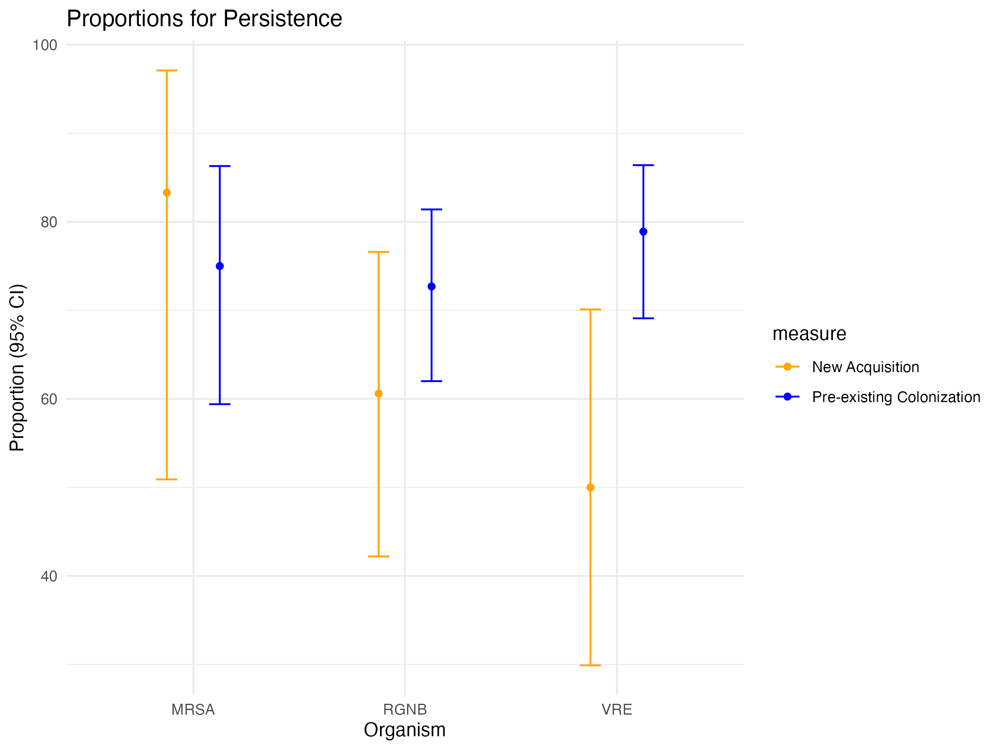
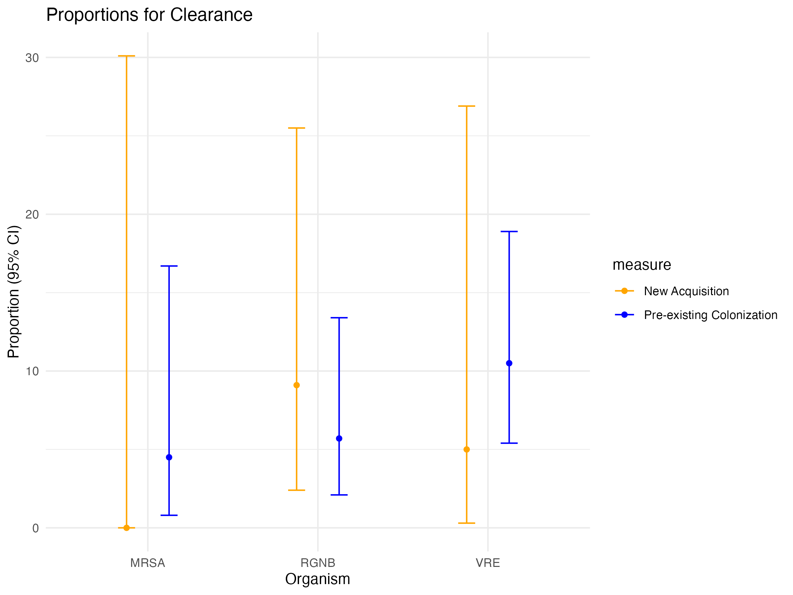
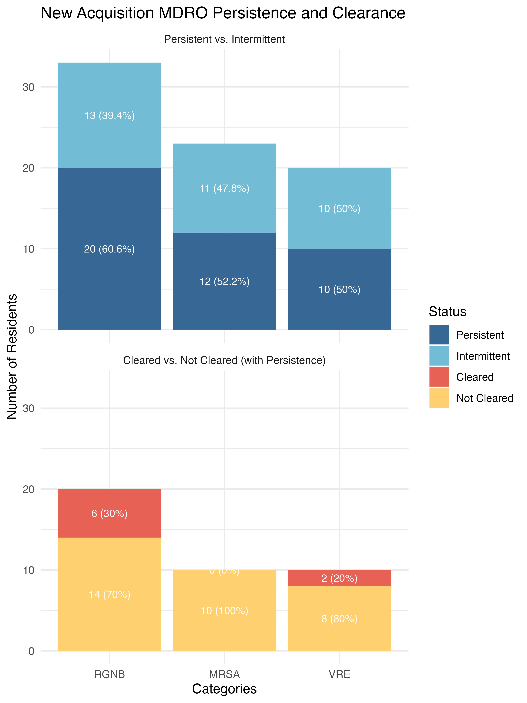
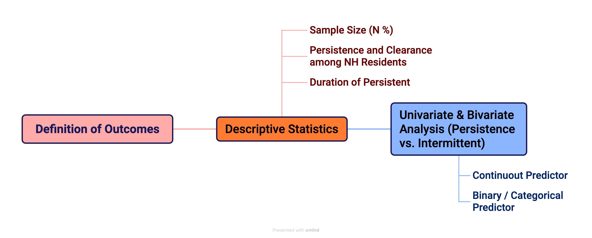

# Project Summary

This project presents my CRIISP / CHIP internship work on multidrug-resistant organism persistence, clearance, and acquisition in nursing home residents. The analysis centered on longitudinal Pathways study data and focused on comparing organism-specific outcomes for RGNB, MRSA, and VRE, including pre-existing colonization, new acquisition, and intervention-related patterns.

The portfolio emphasizes the coding and analysis workflow rather than the full research archive. It includes the main Quarto notebooks, selected poster and summary outputs, and a small set of aggregate RGNB summary tables.

# Main Questions

1. How often do pre-existing versus newly acquired MDROs persist during follow-up?
2. How often do persistent organisms clear, and how do those rates vary by organism?
3. How does intervention status change the way these outcomes are summarized and compared?
4. How can these findings be translated into publication-style figures and poster visuals?

# Repository Guide

- `code/01_pathways_persistence_analysis.qmd`: core Pathways persistence workflow
- `code/02_pathways_intervention_analysis.qmd`: intervention-aware extension of the main analysis
- `code/03_poster_visualization.qmd`: cleaned poster figure workflow for persistence and clearance plots
- `code/04_poster_visualization_alt.qmd`: alternate poster visualization notebook
- `code/05_rgnb_preliminary_analysis.qmd`: follow-on RGNB preliminary analysis
- `source_code/`: preserved copies of the original notebook files
- `docs/`: internship summary PDFs, posters, and the visual abstract
- `figures/`: representative plots used in reporting and poster design
- `data_summaries/`: aggregate RGNB resistance output tables only

# Project Workflow

## 1. Data Import and Variable Engineering

The main Pathways notebooks begin by loading longitudinal study data, selecting the needed variables, replacing placeholder codes such as `99` and `999` with missing values, and deriving analysis-friendly covariates such as BMI, intervention status, race, sex, comorbidity groupings, and organism-site burden categories.

Representative code file:

`code/01_pathways_persistence_analysis.qmd`

Representative logic:

```r
test_subset[test_subset == "99"] <- NA
test_subset[test_subset == "999"] <- NA

test_subset <- test_subset %>%
  mutate(BMI = (weight_bl * 703) / (height_bl^2))

test_subset <- test_subset %>%
  mutate(visit_intervened = case_when(
    phase == 1 ~ 0,
    phase == 2 & intervention == 0 ~ 0,
    phase == 2 & intervention == 1 ~ 1
  ))
```

This stage is important because the downstream persistence and clearance summaries depend on consistent variable recoding across many organism- and visit-level fields.

## 2. Persistence and Clearance Analysis

The central internship analysis examined persistence and clearance outcomes for RGNB, MRSA, and VRE across both pre-existing colonization and new acquisition groups. The main notebooks prepare organism-specific subsets and generate the tables and figures later used for reporting.

Representative code files:

- `code/01_pathways_persistence_analysis.qmd`
- `code/02_pathways_intervention_analysis.qmd`

Representative output figures:





## 3. Intervention-Aware Analysis

One extension of the core workflow explicitly incorporated intervention status and created analysis subsets that compare outcomes under intervention versus non-intervention conditions. This is reflected most clearly in the second Pathways notebook, which keeps additional persistence, clearance, and duration variables for organism-specific summaries.

Representative code file:

`code/02_pathways_intervention_analysis.qmd`

Representative logic:

```r
Pathway <- Pathway %>%
  mutate(visit_intervened = case_when(
    phase == 1 ~ 0,
    phase == 2 & intervention == 0 ~ 0,
    phase == 2 & intervention == 1 ~ 1
  ))
```

## 4. Poster Figure Development

The internship also involved translating the analysis into poster-ready figures. The poster notebooks use `ggplot2` to build grouped bar plots, error bars, no-legend variants, and higher-clarity presentation figures for pre-existing colonization and new acquisition comparisons.

Representative code files:

- `code/03_poster_visualization.qmd`
- `code/04_poster_visualization_alt.qmd`

Representative figure outputs:






## 5. Research Communication Outputs

Beyond the analysis itself, the internship produced multiple communication artifacts that show how the coding work supported poster preparation and broader project reporting.

Included documents:

- `docs/CHIP_Poster_Skylar Zeng_11182024.pdf`
- `docs/The Exchange Poster_Skylar Zeng_MDRO.pdf`
- `docs/CHIP-CRIISP Internship Summary_Skylar Zeng.pdf`
- `docs/2024 CHIP Internship Summary_Skylar Zeng.pdf`
- `docs/VisualAbstract_Primer_v4_1.pdf`

## 6. RGNB Follow-On Analysis

The folder also contains a later RGNB-focused preliminary analysis. This work is smaller than the main Pathways internship project, but it shows continued work on resistance-oriented summaries and microbiology-derived counts. Only aggregate summary tables are included here.

Representative code file:

`code/05_rgnb_preliminary_analysis.qmd`

Included aggregate outputs:

- `data_summaries/combined_results.csv`
- `data_summaries/count_results.csv`
- `data_summaries/count_results_A_environment.csv`
- `data_summaries/resistance_counts.csv`
- `data_summaries/resistance_percentage_analysis_results.csv`
- `data_summaries/resistance_rates_analysis.csv`
- `data_summaries/resistance_table_formatted.csv`

# Why This Is a Strong Coding Artifact

- It shows real data cleaning and derived-variable construction in R rather than only static plotting.
- It combines longitudinal epidemiology logic with organism-specific outcome modeling.
- It demonstrates a complete path from analysis notebook to communication artifact.
- It includes both mainline analysis and a smaller follow-on RGNB extension, which helps show continuity of technical work.

# Notes

- Raw patient-level Pathways datasets are intentionally not included in this portfolio version.
- The included `data_summaries/` files are aggregate outputs rather than the original underlying records.
- This repository is designed to be upload-friendly and reviewer-friendly rather than a complete lab archive.
